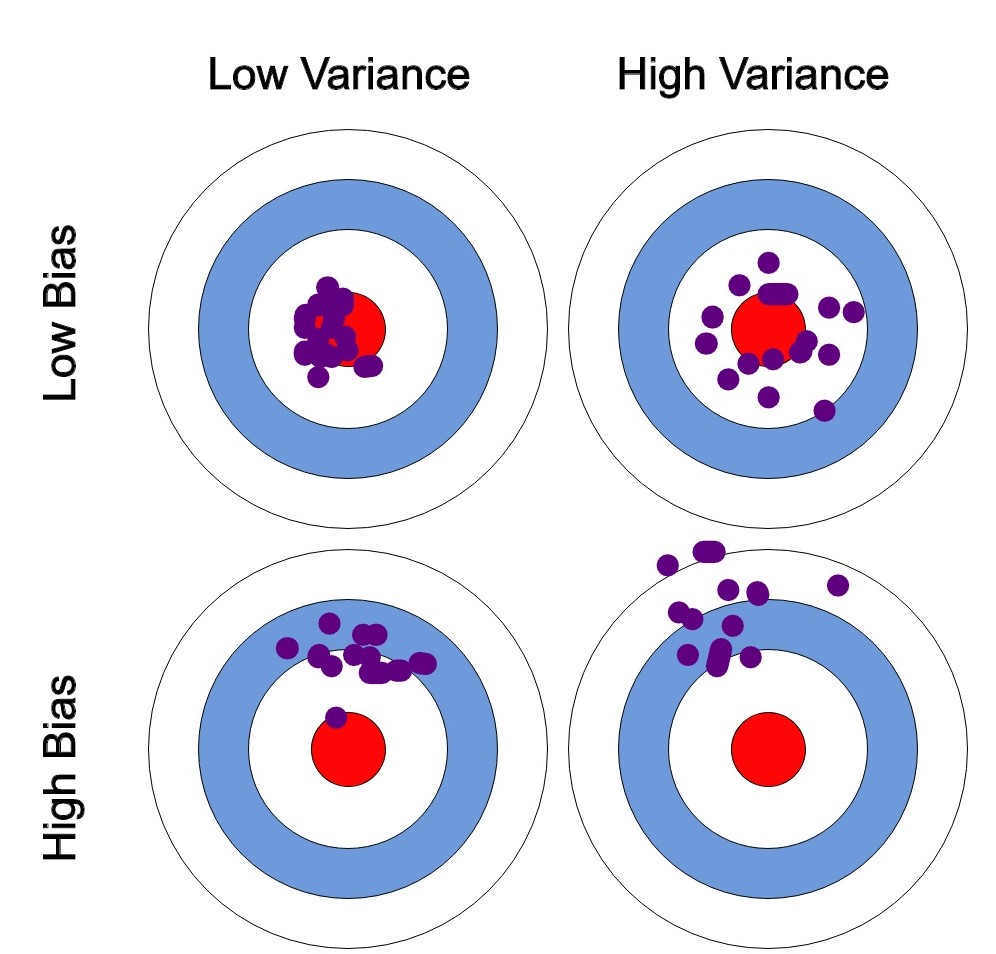

# NOTES

## epochs & batch size

Gradient Descent
learning rate
cost/lost/loss
dataset
epoch/batch size/iteration
weights/step

dataset → epoch → batch → iteration

under-fitting/optimal/overfitting
accuracy/predication
bias/variance
bias = simple/simplistic assumption/poor performance
*variance = sensitivity/fluctuations* spread of data
high bias = under fitting
low bias / low variance = good fitting
high variance = over fitting
training data/testing data
training error/test error
under fitting = high training error/training error close to test error/high bias

1. [[Epoch vs Batch Size vs Iterations](https://towardsdatascience.com/epoch-vs-iterations-vs-batch-size-4dfb9c7ce9c9)]
   [[Epoch, Batch Size, Iteration in Neural Network Training Process](https://medium.com/@crazyhatcap/epoch-batch-size-iteration-in-neural-network-training-process-bee58415eb8e)]
2. [[ML | Under fitting and Overfitting](https://www.geeksforgeeks.org/underfitting-and-overfitting-in-machine-learning)]
3. [[Under fitting Vs Just right Vs Overfitting in Machine learning](https://www.kaggle.com/discussions/getting-started/166897)]

## errors

*Variance* is the error that occurs due to sensitivity to small changes in the training set.

prediction error
bias error = |predication value - actual value|
           = error due to squared bias
variance error = error due to variance
reducible/irreducible error

The error due to squared bias is the amount by which the expected model prediction differs from the true value or target, over the training data. Because of that very particular definition, *I tend to think of bias as being introduced at model selection.*  Now, data scientists can repeat the model building process (through resampling) to obtain the average of prediction values.  If these average prediction values are substantially different that the true value, bias will be high.

The error due to variance is the amount by which the prediction, over one training set, differs from the expected predicted value, over all the training sets. As with bias, you can repeat the entire model building process multiple times. To paraphrase Manning et al (2008), variance measures *how inconsistent are the predictions from one another*, over different training sets, not whether they are accurate or not.

1. [[3 Types of Errors in Machine Learning that You Should Know!](https://multimatics.co.id/insight/jan/3-types-of-errors-in-machine-learning-that-you-should-know)]
2. [[Ask a Data Scientist: The Bias vs. Variance Tradeoff](https://insideainews.com/2014/10/22/ask-data-scientist-bias-vs-variance-tradeoff/)]
3. [[What Is the Difference Between Bias and Variance?](https://www.mastersindatascience.org/learning/difference-between-bias-and-variance/)]
4. [[Bias-Variance](https://nvsyashwanth.github.io/machinelearningmaster/bias-variance/)]

## variance

Variance : The average of the squared differences from the mean.

Variance is *standard deviation*.

$\overline{x} = {\frac {1}{n}}{\Sigma_{i=1}^n x_i}$

$variance = \sqrt{{\frac {1}{n}}{\sum_{i=1}^n (x_i-\overline{x})^2}}$

Standard deviation formulation is the following.

$\sigma = \sqrt{{\frac {1}{n}}{\sum (x - \mu)^2}}$

1. [[Variance - clearly explained](https://www.youtube.com/watch?v=x0rmUXWtSS8)]
2. [[Standard Deviation - National Library Medicine](https://www.nlm.nih.gov/oet/ed/stats/02-900.html#:~:text=A%20standard%20deviation%20(or%20%CF%83,data%20are%20more%20spread%20out.)]

## The Central Limit Theorem

1. [[The Central Limit Theorem, Clearly Explained!!!](https://youtu.be/YAlJCEDH2uY)]

## ML 101

Goal

Step 1 : study article [[Machine Learning 101] (https://medium.com/onfido-tech/machine-learning-101-be2e0a86c96a)]
Step 2 : modify code so that it can be run under *WANDB*.